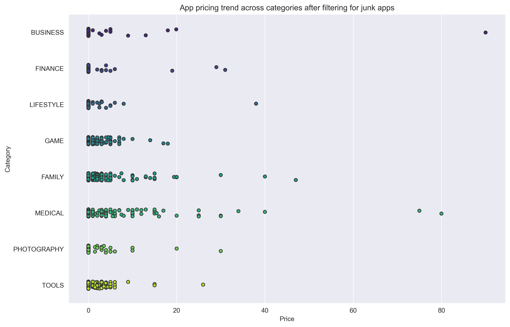
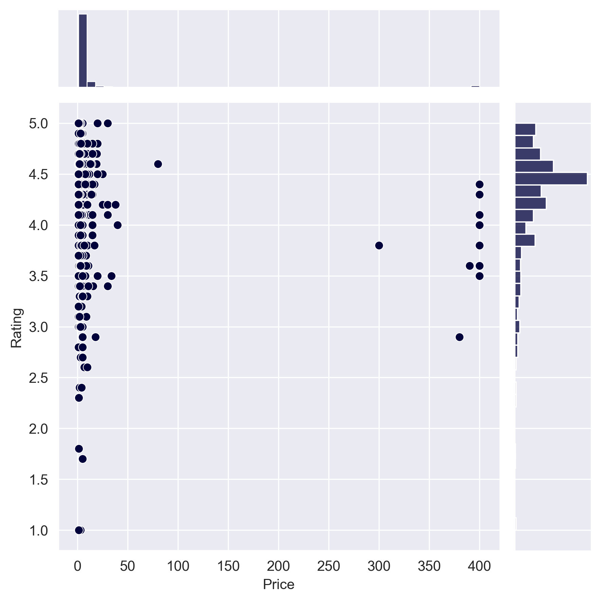
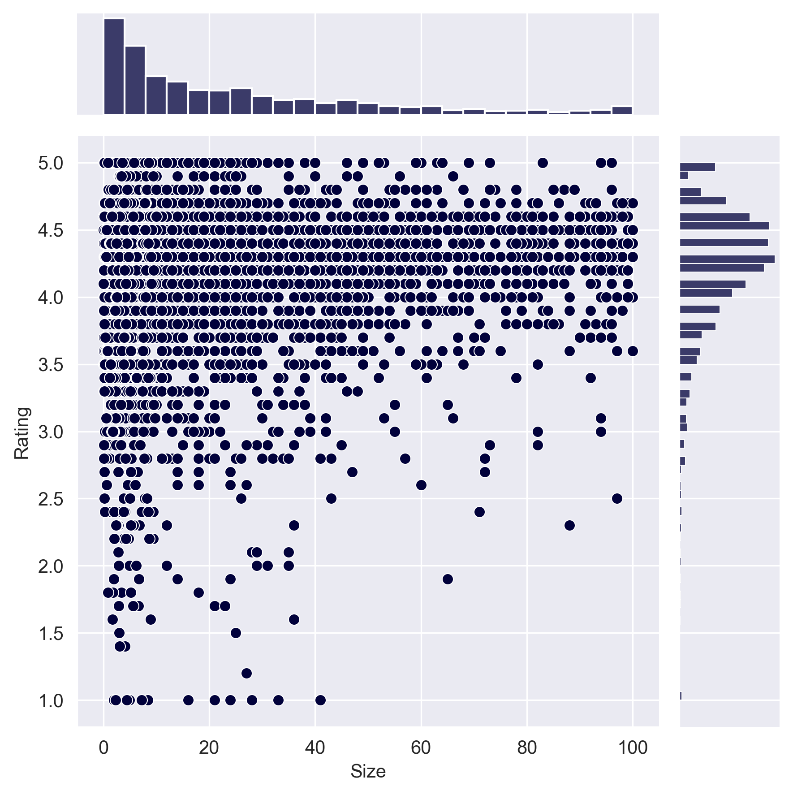

📊 Project Overview
This project performs a comprehensive strategic analysis of the Android app market by evaluating over 10,000 apps across 33 categories. The goal is to provide data-driven insights for developers and stakeholders to optimize pricing strategies, app sizing, and user retention.
By merging market-level data with 100,000+ user reviews, the analysis quantifies the relationship between monetization models and user sentiment polarity.

🚀 Key Features
Data Cleaning Pipeline: Standardized inconsistent features (Installs, Price, Size) and handled missing values across 14 attributes to ensure statistical integrity.
Market Segmentation: Identified pricing "sweet spots" and analyzed the prevalence of "junk" apps to isolate authentic market trends.
Sentiment Analysis: Merged review datasets to compare the sentiment polarity of Free vs. Paid applications using a merged data-frame approach.
Interactive Visualizations: Developed a suite of distributions, joint plots, and box plots to visualize the correlation between app size, price, and rating.

🛠️ Tech Stack
Language: Python
Libraries: Pandas, NumPy, Matplotlib, Seaborn
Environment: Jupyter Notebook

📈 Key Insights
Price Elasticity: 90% of the highest-rated apps are priced under $10, though specialized categories like Medical and Family successfully command premium pricing ($80+).
The "Paid" Advantage: Sentiment analysis reveals that paid apps have higher median sentiment scores and significantly fewer extreme outliers in negative reviews compared to free apps.
Size Constraints: Top-rated applications predominantly fall within the 2MB–20MB range, suggesting a correlation between technical optimization and user satisfaction.

📊 Key Insights & Visualizations

  1. Market Distribution across Categories

*Insight: The market is dominated by Game and Family apps, suggesting high competition but proven demand in these sectors.*

  2. Strategic Pricing Trends (Outliers Removed)

*Insight: Once "junk" apps are removed, most categories show a clear $10 psychological price ceiling, while Medical apps maintain a premium niche.*

  3. Impact of Pricing on User Ratings

*Insight: Higher-priced apps do not guarantee better ratings; the highest density of 4.5+ star reviews stays within the free-to-$10 bracket.*

  4. Technical Footprint vs. Product Quality

*Insight: User satisfaction peaks for apps between 2MB and 20MB. Optimizing for a smaller file size is a key driver for higher user ratings.*
